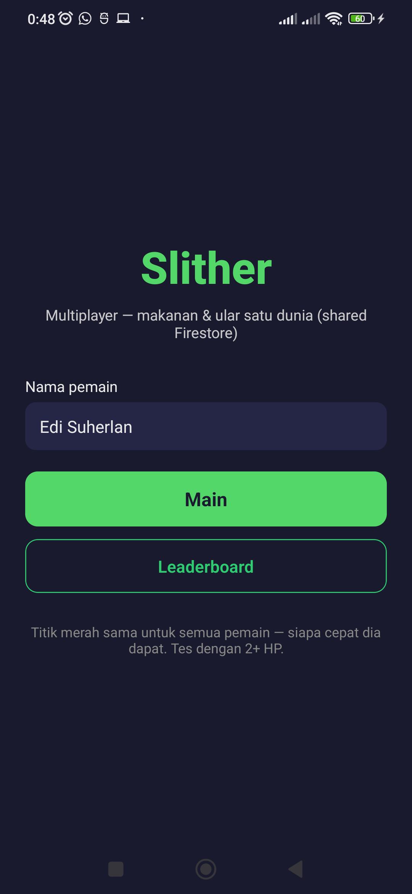
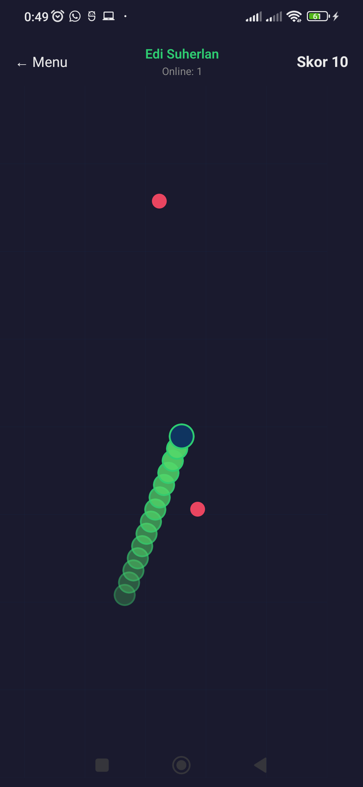

# 🐍 EXPO Game Slither

**Slither.io versi pembelajaran** — game mobile multiplayer sederhana pakai **Expo (React Native)** + **Firebase Firestore**. Cocok buat mahasiswa yang mau belajar game loop, real-time database, dan build APK tanpa ribet native code dulu.

| | |
|---|---|
| **Author** | [Edi Suherlan](https://github.com/edisuherlan) |
| **Repository** | [github.com/edisuherlan/EXPO-Game-Slither](https://github.com/edisuherlan/EXPO-Game-Slither) |
| **Firebase project** | `gameslither-28be8` |
| **Package Android** | `com.audhighasu.slither` |
| **Expo SDK** | 54 |

---

## 📸 Cuplikan aplikasi

### Menu utama
Layar pertama: isi nama pemain, lalu **Main** atau lihat **Leaderboard**.



### Saat bermain
Ular hijau kamu, makanan merah shared (sama di semua HP), HUD skor & jumlah pemain online.



---

## ✨ Apa yang bisa dilakukan app ini?

- 🎮 **Kendali ular** — sentuh layar, arah mengikuti jari (seperti Slither.io)
- 🌍 **Dunia besar** — peta 5× lebih luas dari layar HP, kamera mengikuti kepala ular
- 🍎 **Makanan shared** — titik merah di Firestore; siapa cepat makan, skor naik (+10) & ular memanjang
- 👥 **Multiplayer** — lihat ular pemain lain real-time (`games/global/live`)
- 🏆 **Leaderboard** — skor terbaik tersimpan di Firestore
- 📦 **Build APK** — siap pakai EAS Build (profil `preview` → file `.apk`)

Intinya: ini **simulasi lab**, bukan clone Slither.io production. Fokusnya **kode yang bisa dibaca** + komentar pembelajaran di setiap file.

---

## 🧱 Arsitektur singkat

```
index.ts → App.tsx (navigasi 3 layar)
              ├── HomeScreen        → nama + AsyncStorage
              ├── GameScreen        → hooks multiplayer & makanan
              │     └── GameBoard   → render + game loop
              └── LeaderboardScreen → query Firestore

game/engine.ts      → physics ular (tick, makan, tabrakan)
hooks/useGameLoop   → requestAnimationFrame
services/*          → Firestore (skor, live players, makanan)
lib/firebase.ts     → inisialisasi Firebase
```

**Alur data saat main:**

1. `GameBoard` jalankan loop ~60 FPS → `tick()` geser kepala  
2. Tabrakan makanan → skor/panjang naik **langsung** (optimistic), lalu hapus dokumen `slither_foods`  
3. Setiap ~200 ms posisi ular dikirim ke `games/global/live/{playerId}`  
4. HP lain `onSnapshot` → gambar ular remote  
5. Game over → simpan ke `scores` + update `leaderboard` jika skor terbaik  

---

## 🛠️ Tech stack

| Lapisan | Teknologi |
|---------|-----------|
| Mobile | [Expo](https://expo.dev) ~54, React Native 0.81, TypeScript |
| Backend | [Firebase Firestore](https://firebase.google.com/docs/firestore) (JS SDK) |
| Storage lokal | `@react-native-async-storage/async-storage` |
| Build | [EAS Build](https://docs.expo.dev/build/introduction/) |

---

## 📁 Struktur folder

| Folder / file | Isi |
|---------------|-----|
| `screens/` | Halaman: Home, Game, Leaderboard |
| `components/game/` | `GameBoard` — render ular, makanan, sentuh |
| `game/` | Engine, kamera, tubuh ular, tabrakan multiplayer |
| `hooks/` | `useGameLoop`, `useMultiplayer`, `useSharedFoods` |
| `services/` | CRUD Firestore & AsyncStorage |
| `constants/` | Balance game, nama koleksi, config Firebase |
| `firestore.rules` | Rules lab (`allow read, write: if true`) — **wajib Publish** |
| `docs/` | Screenshot untuk README |
| `eas.json` | Profil build APK |

---

## 🚀 Cara menjalankan (development)

### Prasyarat

- [Node.js](https://nodejs.org/) LTS (18+)
- [Expo Go](https://expo.dev/go) di HP (SDK **54** — sesuai project)
- Akun Firebase + project `gameslither-28be8` (atau ganti config sendiri)

### Langkah

```bash
# Clone repo
git clone https://github.com/edisuherlan/EXPO-Game-Slither.git
cd EXPO-Game-Slither

# Install dependency
npm install

# Jalankan Metro
npx expo start
```

Scan QR dengan **Expo Go**, atau tekan `a` untuk emulator Android.

> **Tips:** Kalau cache aneh, coba `npx expo start -c`.

### Firebase — jangan lupa ini

1. Buka [Firebase Console](https://console.firebase.google.com/) → project **gameslither-28be8**
2. **Firestore** → buat database (mode test/lab OK)
3. **Rules** → salin isi `firestore.rules` → **Publish**
4. Pastikan `google-services.json` ada di root (untuk build native)

Tanpa Rules yang di-Publish, makanan shared & multiplayer bisa gagal — app fallback ke makanan lokal (ada peringatan di HUD).

---

## 📲 Build APK (release / distribusi ke mahasiswa)

```bash
# Login Expo (sekali)
npx eas-cli login

# Build APK cloud
npm run build:apk
```

Atau:

```bash
npx eas-cli build -p android --profile preview
```

Setelah selesai, unduh `.apk` dari link Expo. Profil `preview` di `eas.json` menghasilkan **APK** (bukan AAB Play Store).

---

## 🗄️ Koleksi Firestore

| Koleksi | Fungsi |
|---------|--------|
| `slither_foods` | Makanan shared `{ x, y, roomId }` |
| `slither_room/global` | Metadata ruang |
| `games/global/live/{playerId}` | Posisi ular pemain (real-time) |
| `scores` | Riwayat setiap game over |
| `leaderboard/{playerId}` | Skor terbaik per pemain |

---

## 🎓 Untuk dosen / mahasiswa

- Setiap file `.ts` / `.tsx` punya **komentar pembelajaran** (Bahasa Indonesia) + footer author.
- Urutan baca disarankan: `App.tsx` → `screens/` → `GameBoard.tsx` → `game/engine.ts` → `hooks/` → `services/`
- Uji multiplayer: buka app di **2 HP atau lebih** dengan WiFi/data aktif, nama berbeda, lihat `Online: N` naik.

**Eksperimen lab yang seru:**

- Ubah `constants/game.ts` → `worldScale`, `scorePerFood`, `baseSpeed`
- Tambah autentikasi di Rules (ganti `if true` — wajib untuk production!)
- Bandingkan latency: kurangi `SYNC_INTERVAL_MS` di `constants/multiplayer.ts`

---

## ⚠️ Catatan keamanan (penting)

Rules saat ini **`allow read, write: if true`** — sengaja untuk **kelas / simulasi**, bukan production publik.

Untuk rilis nyata: pakai Firebase Auth + rules ketat, jangan commit service account, rotate API key jika bocor.

---

## 📜 Scripts npm

| Perintah | Keterangan |
|----------|------------|
| `npm start` | Expo dev server |
| `npm run android` | Buka di Android |
| `npm run build:apk` | EAS build APK (preview) |

---

## 🤝 Kontribusi & lisensi

Project ini dibuat untuk edukasi. Fork, modifikasi, dan pakai di materi kuliah boleh — sebut sumbernya ya.

**Dibuat oleh [Edi Suherlan](https://github.com/edisuherlan)** · [audhighasu.com](https://audhighasu.com)

---

<p align="center">
  <sub>⭐ Kalau bermanfaat untuk praktikum, star repo-nya di GitHub!</sub>
</p>
