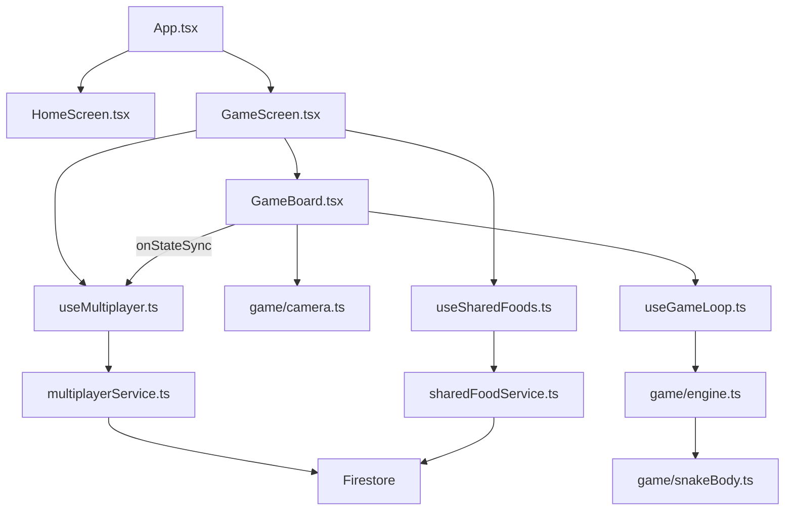
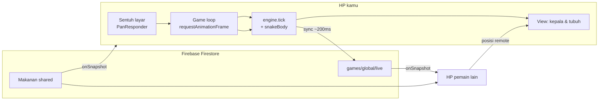

# Cerita Ulat di Game Slither (Expo)

Dokumen ini menjelaskan **secara santai** bagaimana ulat di game ini “hidup”: bisa dikontrol dari HP, bisa banyak pemain online, bisa makan dan memanjang. Tidak perlu paham React dulu — baca bagian cerita dulu; lalu lanjut ke **Tur halaman kode** untuk penjelasan tiap file/folder yang relevan.

---

## Ulat itu sebenarnya apa?

Kalau di game klasik ular = kotak-kotak di grid, di project ini ulat **bukan satu gambar**, melainkan **rantai titik** di dunia 2D.

- Setiap titik punya koordinat `x` dan `y` (tipe `Vec2`).
- Titik pertama = **kepala**, sisanya = **tubuh**.
- Semua titik disimpan dalam array, misalnya `snake: [{x, y}, {x, y}, ...]`.
- Panjang “logis” ulat disimpan terpisah di `length` (bukan cuma `snake.length`), karena tubuh bisa disusun ulang tiap frame.

Di layar, setiap titik digambar sebagai **lingkaran kecil** pakai komponen `View` React Native (bukan canvas/Skia). Jadi “objek ulat” = data matematika + banyak `View` yang posisinya di-update terus.

---

## Kenapa bisa dikontrol di Expo? Metode apa?

Expo di sini dipakai sebagai **React Native app** biasa. Kontrol ulat tidak pakai sensor khusus — cukup **sentuhan jari** di layar game.

### 1. Sentuhan → arah (steering)

Ada lapisan transparan di atas papan game (`touchLayer`) yang menangkap sentuhan lewat **`PanResponder`** (API bawaan React Native):

- Saat jari **menyentuh atau menggeser**, posisi jari di layar dibandingkan dengan posisi **kepala ulat di layar** (bukan koordinat dunia mentah).
- Dari selisihnya dihitung sudut arah pakai `Math.atan2` → disimpan sebagai `targetAngle` (radian).
- Saat jari **dilepas**, mode steering mati; ulat tetap jalan ke arah terakhir.

Intinya: **arahkan jari ke mana ulat harus menuju**, seperti joystick virtual yang mengikuti kepala.

### 2. Game loop → ulat bergerak halus

Gerak ulat **tidak** dihitung di `onPress` sekali saja. Ada **loop permainan** ~60 FPS memakai `requestAnimationFrame` (hook `useGameLoop`):

1. Hitung `dt` = waktu antar frame (detik).
2. Panggil `tick()` di **engine** (file murni TypeScript, tanpa UI).
3. Engine memutar sudut ulat secara halus (`lerpAngle`) menuju `targetAngle`.
4. Kepala digeser: `x += cos(sudut) × kecepatan × dt`, sama untuk `y` dengan `sin`.
5. Tubuh mengikuti kepala (lihat bagian “memanjang” di bawah).

React dipakai untuk **menggambar** hasil terakhir; fisika inti ada di engine supaya logika game terpisah dari UI.

### 3. Kamera mengikuti kepala

Dunia game **lebih besar** dari layar HP (skala `worldScale`, biasanya 5× lebar/tinggi viewport). Yang terlihat di layar hanya “jendela” yang selalu memusatkan **kepala** di tengah. Rumus sederhana:

`posisi di layar = posisi dunia − offset kamera`

Makanya saat mengarahkan sentuhan, arah dihitung relatif kepala **di layar**, supaya terasa natural.

---

## Bagaimana banyak ulat online, masing-masing dikontrol HP sendiri?

Ini pola **multiplayer ringan** lewat **Firebase Firestore**, bukan server game khusus dengan WebSocket sendiri.

### Satu “ruang” bersama

Semua pemain masuk ke ruang yang sama, path-nya kira-kira:

`games/global/live/{playerId}`

- `global` = satu dunia bersama untuk latihan/demo.
- Setiap HP punya **`playerId` unik** (disimpan lokal, dibuat sekali).
- Saat masuk game: **join** → tulis dokumen live.
- Saat keluar / tutup layar: **leave** → hapus dokumen.

### Siapa mengontrol ulat siapa?

| Ular | Siapa yang menghitung gerak | Siapa yang mengirim ke cloud |
|------|----------------------------|------------------------------|
| Ular kamu | **HP kamu** (engine + sentuhan) | HP kamu → Firestore tiap ~200 ms |
| Ular orang lain | **HP mereka** | Kamu hanya **baca** posisi mereka |

Jadi kontrol tetap **lokal dan responsif** di perangkat masing-masing. Cloud hanya dipakai untuk **berbagi posisi**, skor, panjang, nama, warna, dan status hidup/mati.

### Real-time: subscribe, bukan refresh manual

HP lain tidak “nanya” server tiap detik dengan polling manual. App memakai **`onSnapshot`** Firestore: begitu ada yang update dokumen `live`, listener otomatis dapat data baru → state React berubah → ulat remote digambar lagi.

Agar tidak boros kuota/baterai:

- Posisi dikirim **throttle** (default tiap **200 ms**), bukan tiap frame.
- Segmen tubuh yang dikirim **dibatasi** (misalnya maks ~18 titik) dengan sampling — tubuh panjang di HP lain tetap terlihat “cukup” tanpa kirim ratusan titik.

Pemain yang lama tidak update (misalnya > 8 detik) dianggap **offline** dan tidak ditampilkan.

### Tabrakan antar pemain

Fisika tubuh sendiri dihitung di HP kamu. Tabrakan kepala kamu ke tubuh **pemain lain** dicek di `GameBoard` dengan jarak kepala ke segmen remote. Kalau kena → `status: dead` → game over → Firestore ditandai `alive: false`.

---

## Bagaimana ulat bisa makan dan bertambah panjang?

### Makanan: satu kolam untuk semua

Makanan disimpan di Firestore (koleksi shared, lewat `useSharedFoods`). Semua pemain **melihat titik makan yang sama** lewat subscribe real-time.

Kalau Firestore belum siap (rules, offline, dll.), app punya **fallback**: makanan dibuat lokal di HP supaya layar tidak kosong — tapi itu tidak sinkron antar pemain.

### Deteksi “kena” makanan

Tiap frame, setelah kepala bergerak, dicek apakah jarak kepala ke salah satu makanan < radius kepala + radius makanan + sedikit toleransi (`findFoodAtHead`). Ini deteksi **lingkaran**, bukan kotak grid.

### Setelah makan — panjang, skor, kecepatan

Saat kena:

1. **`length`** naik (misalnya +4 per butir makan — lihat `growPerFood`).
2. **`score`** naik (misalnya +10 per makan).
3. **`speed`** sedikit naik (dibatasi maksimum supaya tidak terlalu gila).
4. Tubuh di-**rebuild** dengan `updateSnakeSegments` supaya segmen baru ikut rantai.

Makanan di Firestore di-**hapus** (consume) lalu **respawn** satu titik baru di tempat lain — supaya kolam makanan tetap terisi.

Ada pola **optimistic**: skor/panjang naik dulu di HP; hapus makanan di cloud bisa sedikit belakangan. Jadi terasa langsung, tidak nunggu jaringan.

### Kenapa tubuh “mengikuti” dan terlihat memanjang?

Bukan dengan menambah segmen di ekor secara instan di satu frame. Setiap frame:

1. Kepala pindah ke posisi baru.
2. Segmen ke-2 mengejar segmen ke-1, ke-3 mengejar ke-2, dst., dengan **jarak tetap** antar segmen (`segmentSpacing`).
3. `length` menentukan **berapa segmen** yang dihitung.

Saat `length` bertambah setelah makan, rantai punya lebih banyak titik — visualnya ulat **memanjang**.

Tabrakan ke tubuh sendiri: kepala dicek ke segmen yang cukup jauh dari kepala (ada `skip` segmen dekat kepala) supaya ulat pendek tidak langsung mati karena geometri.

---

## Alur besar dalam satu kalimat

**Kamu menyentuh layar → sudut tersimpan di ref → loop 60 FPS menggerakkan kepala & tubuh di engine → React menggambar lingkaran-lingkaran → posisi dikirim ke Firestore → HP lain menggambar ulatmu → makanan shared dari Firestore → makan = panjang & skor naik.**

---

## Tur halaman kode — baca file mana dulu?

Kalau baru buka project, urutan ini paling enak (dari “app biasa” → “inti game” → “online”):

1. `App.tsx` → pindah layar
2. `screens/HomeScreen.tsx` → nama pemain
3. `screens/GameScreen.tsx` → menyambungkan semua hook
4. `components/game/GameBoard.tsx` → tempat ulat benar-benar jalan
5. `hooks/useGameLoop.ts` + `game/engine.ts` + `game/snakeBody.ts` → fisika
6. `hooks/useMultiplayer.ts` + `services/multiplayerService.ts` → ulat orang lain
7. `hooks/useSharedFoods.ts` + `services/sharedFoodService.ts` → makanan bersama

Di bawah ini tiap file dijelaskan **peran + isi penting + hubungan ke bagian cerita di atas**.

---

### Struktur folder (peta singkat)

```
game_slither/
├── App.tsx                 ← pintu masuk, navigasi 3 layar
├── index.ts                ← register root ke Expo
├── screens/                ← halaman UI (menu, game, leaderboard)
├── components/game/        ← papan permainan (ular digambar di sini)
├── hooks/                  ← logika React yang dipakai ulang (loop, multiplayer, makanan)
├── game/                   ← engine murni (tanpa JSX) — fisika & kamera
├── services/               ← bicara ke Firestore & AsyncStorage
├── constants/              ← angka gameplay & config Firebase
├── types/                  ← bentuk data TypeScript
└── lib/firebase.ts         ← inisialisasi Firebase sekali untuk seluruh app
```

---

### 1. `App.tsx` — “remote control” antar layar

**Peran:** Root aplikasi. Tidak ada React Navigation — cukup state `screen`: `'home' | 'game' | 'leaderboard'`.

**Yang perlu dicatat:**

- `displayName` disimpan di sini setelah user mengetik nama di Home dan menekan Main.
- Hanya **satu** layar yang di-render pada satu waktu (conditional `{screen === '...'}`).
- `GameScreen` menerima `displayName`, `onBack`, `onLeaderboard`.

**Hubungan gameplay:** Belum ada ulat di file ini — murni routing. Tapi ini menjelaskan **dari mana nama pemain** yang nanti muncul di HUD dan Firestore.

---

### 2. `screens/HomeScreen.tsx` — menu & identitas lokal

**Peran:** Layar pertama: input nama, tombol Main & Leaderboard.

**Kode penting:**

- `getOrCreatePlayerId()` — dipanggil saat mount; ID unik disimpan di HP (AsyncStorage).
- `getDisplayName()` / `saveDisplayName()` — nama tampilan persist.
- `onPlay(trimmed)` — callback ke `App.tsx` → pindah ke game.

**Kenapa penting untuk multiplayer:** `playerId` dipakai sebagai **ID dokumen** di Firestore (`live/{playerId}`). Tanpa ID stabil, setiap buka app bisa dianggap pemain baru.

---

### 3. `screens/GameScreen.tsx` — orkestrator (bukan tempat menggambar ulat)

**Peran:** “Manajer” layar game. **Tidak** menggambar segmen ulat — itu tugas `GameBoard`.

**Yang disambungkan di sini:**

| Hook / komponen | Fungsi |
|-----------------|--------|
| `useMultiplayer` | join room, subscribe pemain lain, sync posisi, tandai mati |
| `useSharedFoods` | daftar makanan + `consumeFood` |
| `GameBoard` | loop, sentuh, render ulat & makanan |
| HUD | skor, jumlah online, peringatan Firestore |
| `handleGameOver` | simpan skor ke leaderboard Firestore |

**Alur callback:**

- `onStateSync(state)` → setiap frame (throttle di hook) kirim `GameState` ke cloud.
- `onWorldReady` → ukuran dunia dari `GameBoard` dipakai hook makanan untuk seed/subscribe.

**Tips baca:** Kalau bingung “di mana multiplayer?”, jawabannya: **di sini dipanggil**, implementasinya di `hooks/useMultiplayer.ts`.

---

### 4. `components/game/GameBoard.tsx` — jantung visual & input

**Peran:** Papan permainan. Ini file **paling padat** untuk memahami ulat di layar.

**State & ref penting:**

- `gameState` — posisi ulat, skor, status `playing` / `dead`.
- `inputRef` — `targetAngle` + `steering`; di-update sentuhan **tanpa** re-render tiap gerakan jari (hemat performa).
- `gameStateRef` — salinan untuk loop; `handleUpdate` wajib return state terbaru.
- `remotePlayersRef` / `sharedFoodsRef` — hindari data stale di dalam loop.

**Urutan per frame (inti):**

1. `useGameLoop` panggil `tick()` (`engine.ts`).
2. `handleUpdate` — cek makan, tabrakan remote, update React state, panggil `onStateSync`.
3. Render: makanan → ulat remote → ulat kamu → overlay game over.
4. `touchLayer` + `PanResponder` di atas semua (`zIndex` tinggi) — entity pakai `pointerEvents="none"` supaya sentuhan tembus.

**Kontrol sentuh (cuplikan konsep):**

- `updateAngle(touchX, touchY)` — bandingkan jari dengan kepala **di koordinat layar** (`head - camera`).
- `Math.atan2(dy, dx)` → `inputRef.current.targetAngle`.

**Makan:**

- `findFoodAtHead` → `applyEatBonus` → `updateSnakeSegments` lagi.
- `onConsumeFood(id, headPos)` — hapus di Firestore (async).

**Gambar ulat remote:**

- Loop `remotePlayers` → tiap `segments[i]` jadi `View` bulat dengan warna `remote.color`.

Buka file ini sambil baca bagian “Kontrol di Expo” dan “Makan” di dokumen ini — cocok 1:1.

---

### 5. `hooks/useGameLoop.ts` — detak jantung 60 FPS

**Peran:** Menjalankan `requestAnimationFrame` selama `status === 'playing'`.

**Alur dalam loop:**

1. Hitung `dt` (delta time), dibatasi maks 0.05 detik supaya tab tidak “loncat”.
2. `tick(current, inputRef.current, dt)` dari engine.
3. `onUpdate(next)` — di project ini = `handleUpdate` di `GameBoard`.
4. Simpan hasil ke `stateRef`; lanjut frame berikutnya jika masih hidup.

**Pola belajar:** Memisahkan **waktu/fisika** (hook + engine) dari **UI** (React state). Mahasiswa sering salah karena `onUpdate` tidak return state — skor bisa reset tiap frame; komentar di file ini sengaja menegaskan itu.

---

### 6. `game/types.ts` — kamus data game

**Peran:** Mendefinisikan bentuk data tanpa logika.

| Type | Arti |
|------|------|
| `Vec2` | Titik `{ x, y }` |
| `Food` | Titik + `id` (doc Firestore atau `local-xxx`) |
| `GameState` | Seluruh sesi: `snake`, `angle`, `score`, `length`, `speed`, ukuran dunia, `status` |
| `GameInput` | Arah target + apakah user sedang steering |

Semua file engine/hook mengacu ke sini — baca dulu supaya tidak bingung istilah.

---

### 7. `constants/game.ts` — “tombol sulap” balance

**Peran:** Satu tempat untuk angka gameplay.

Contoh yang sering diubah saat uji coba:

- `initialLength`, `growPerFood`, `scorePerFood`
- `baseSpeed`, `turnSpeed`, `turnSpeedWhileSteering`
- `segmentSpacing`, `headRadius`, `foodRadius`
- `worldScale` (besar dunia vs layar)

**Tidak ada JSX** — aman dieksperimen tanpa takut merusak UI.

---

### 8. `constants/multiplayer.ts` — aturan online

| Konstanta | Efek |
|-----------|------|
| `MULTIPLAYER_ROOM_ID` | Nama ruang (`global`) |
| `SYNC_INTERVAL_MS` | Seberapa sering posisi dikirim (200 ms) |
| `PLAYER_STALE_MS` | Pemain dianggap offline (8 detik) |
| `MAX_SYNC_SEGMENTS` | Banyak titik tubuh yang dikirim ke Firestore |

---

### 9. `game/engine.ts` — otak fisika (tanpa React)

**Peran:** Logika murni fungsi. Bisa dibayangkan seperti “server game” di dalam HP.

**Fungsi utama:**

| Fungsi | Apa yang dilakukan |
|--------|-------------------|
| `createGameState` | Ular awal di tengah dunia, dunia = viewport × `worldScale` |
| `tick` | Satu frame: belok halus, geser kepala, update segmen, cek tabrakan tubuh sendiri |
| `findFoodAtHead` | Apakah kepala menabrak lingkaran makanan |
| `applyEatBonus` | Tambah `length`, `score`, sedikit `speed` |
| `createLocalFallbackFoods` | Makanan palsu di HP jika Firestore kosong |
| `computeFoodCount` | Berapa banyak makanan yang perlu di-seed |

**Rumus gerak kepala (intuisi):**

```
kepalaBaru.x = kepala.x + cos(sudut) × speed × dt
kepalaBaru.y = kepala.y + sin(sudut) × speed × dt
```

`lerpAngle` membuat belokan tidak patah-patah saat jari digeser.

---

### 10. `game/snakeBody.ts` — tubuh mengikuti kepala

**Peran:** Setelah kepala pindah, segmen 2..N mengejar segmen di depannya dengan jarak tetap.

- `updateSnakeSegments(newHead, prevSegments, segmentCount)` — inti visual “ular melengkung”.
- `checkBodyCollision` — mati jika kepala menabrak tubuh sendiri; ada `skipUntil` supaya segmen dekat kepala tidak langsung membunuh.

**Hubungan `length`:** `segmentCount` dari state, bukan sekadar `snake.length` — saat makan, `length` naik dulu, lalu fungsi ini membangun lebih banyak titik.

---

### 11. `game/camera.ts` — dunia lebar, layar kecil

**Peran:** Satu fungsi utama: `getCamera(state)`.

Kamera = posisi kepala dikurangi setengah lebar/tinggi viewport → kepala selalu di tengah layar.

Semua render di `GameBoard` pakai:

`left: seg.x - camera.x - radius`

Itu yang membuat pemain merasa bergerak di peta besar, padahal yang bergerak adalah “jendela” (kamera).

---

### 12. `game/multiplayerCollision.ts` — mati karena ulat orang

**Peran:** Cek kepala **kita** vs segmen tubuh **remote** (indeks ≥ 2, bukan kepala lawan).

Dipanggil dari `handleUpdate` di `GameBoard`. Ringkas dan terpisah supaya aturan tabrakan PvP mudah dibaca/diubah.

---

### 13. `hooks/useMultiplayer.ts` — jembatan React ↔ Firestore live

**Peran:** Lifecycle multiplayer di sisi React.

**Saat mount (game mulai):**

1. `getOrCreatePlayerId()`
2. `joinMultiplayerRoom(playerId, displayName)`
3. `subscribeLivePlayers` → isi `remotePlayers` + hitung `onlineCount`

**Saat frame:**

- `syncFromGameState(state)` — hanya jika sudah lewat `SYNC_INTERVAL_MS` sejak sync terakhir.

**Saat mati / unmount:**

- `notifyDeath` → `alive: false`
- `leaveMultiplayerRoom` → hapus dokumen live

---

### 14. `services/multiplayerService.ts` — tulis/baca dokumen `live`

**Peran:** Operasi Firestore untuk pemain online.

**Path data:** `games/{MULTIPLAYER_ROOM_ID}/live/{playerId}`

| Fungsi | Kapan |
|--------|-------|
| `joinMultiplayerRoom` | Masuk ruang |
| `syncPlayerState` | Update posisi + skor + segmen (dikompresi) |
| `subscribeLivePlayers` | `onSnapshot` — daftar pemain lain |
| `setPlayerDead` | Game over |
| `leaveMultiplayerRoom` | Keluar |
| `getPlayerColor` | Warna stabil dari hash `playerId` |
| `compressSegments` | Kurangi titik sebelum kirim ke cloud |

**Filter pemain:** `toRemotePlayer` mengabaikan dokumen yang `updatedAt` sudah terlalu lama (`PLAYER_STALE_MS`).

---

### 15. `hooks/useSharedFoods.ts` — makanan di React

**Peran:** Menyediakan `foods` dan `consumeFood` ke `GameScreen` → `GameBoard`.

**Dua sumber makanan:**

1. Firestore (`foods`) — shared antar pemain.
2. Fallback lokal (`fallbackFoods`) — jika subscribe gagal/kosong.

`displayFoods = foods.length > 0 ? foods : fallbackFoods`

**Saat makan:** panggil `tryConsumeSharedFood`, lalu `respawnSharedFood` agar ada makanan baru.

---

### 16. `services/sharedFoodService.ts` — makanan di Firestore

**Peran:** Koleksi `slither_foods` (lihat `constants/firestoreCollections.ts`).

| Fungsi | Peran |
|--------|-------|
| `subscribeSharedFoods` | Real-time daftar makanan |
| `ensureSharedFoodPool` | Seed batch jika terlalu sedikit |
| `tryConsumeSharedFood` | `deleteDoc` — siapa cepat dia dapat |
| `respawnSharedFood` | Tambah satu titik baru (sering dekat pemakan) |
| `randomFoodPosition` | Acak posisi dengan jarak aman dari titik lain |

Ini menjelaskan kenapa dua pemain bisa “berebut” makanan yang sama — karena satu dokumen dihapus untuk semua subscriber.

---

### 17. `services/playerStorage.ts` — yang disimpan di HP saja

**Peran:** AsyncStorage (key-value lokal).

- `@slither/playerId` — identitas multiplayer.
- `@slither/displayName` — nama di menu.

Tidak perlu internet. Beda dengan skor terbaik yang disimpan di Firestore (`firestoreService.ts`).

---

### 18. `services/firestoreService.ts` — skor & leaderboard

**Peran:** Setelah game over, `saveGameResult` menulis/update dokumen leaderboard (satu doc per `playerId`, simpan `bestScore` jika lebih tinggi).

`LeaderboardScreen` memakai `fetchLeaderboard` untuk menampilkan ranking.

Tidak mempengaruhi gerak ulat real-time — hanya **rekam jejak** setelah mati.

---

### 19. `screens/LeaderboardScreen.tsx` — daftar skor terbaik

**Peran:** UI `FlatList` + loading/error. Data dari Firestore, bukan dari sesi `live`.

Berguna untuk demo “game online + penyimpanan cloud”, terpisah dari loop 60 FPS.

---

### 20. `lib/firebase.ts` + `constants/firebaseConfig.ts`

**Peran:** Inisialisasi Firebase sekali; export `db` untuk semua service.

`experimentalForceLongPolling` membantu koneksi Firestore di beberapa jaringan/emulator Android.

Semua file di folder `services/` meng-import `db` dari sini — **jangan** buat instance Firestore baru di banyak tempat.

---

### 21. `types/multiplayer.ts`

**Peran:** Bentuk data pemain lain setelah di-parse dari snapshot Firestore (`RemotePlayer`) vs payload yang kita tulis (`LivePlayerPayload`).

Membantu autocomplete di TypeScript saat menggambar ulat remote di `GameBoard`.

---

### 22. File pendukung lain (sekali lihat)

| File | Catatan singkat |
|------|-----------------|
| `index.ts` | Entry Expo — memanggil `App` |
| `constants/firestoreCollections.ts` | Nama koleksi Firestore |
| `types/database.ts` | Tipe dokumen leaderboard |
| `firestore.rules` | Aturan keamanan baca/tulis (deploy ke Firebase) |
| `app.json` / `eas.json` | Config build Expo |

---

### Tabel cepat: pertanyaan → buka file mana?

| Pertanyaan | File |
|------------|------|
| Ular digambar di mana? | `components/game/GameBoard.tsx` |
| Sentuhan jari diproses di mana? | `GameBoard.tsx` (`PanResponder`) |
| Gerak per frame di mana? | `hooks/useGameLoop.ts` → `game/engine.ts` |
| Tubuh mengikuti kepala? | `game/snakeBody.ts` |
| Kamera / layar vs dunia? | `game/camera.ts` |
| Banyak pemain online? | `hooks/useMultiplayer.ts` + `services/multiplayerService.ts` |
| Makanan sama untuk semua? | `hooks/useSharedFoods.ts` + `services/sharedFoodService.ts` |
| Ubah kecepatan / panjang tiap makan? | `constants/game.ts` |
| Ubah seberapa halus sync online? | `constants/multiplayer.ts` |
| Simpan skor setelah mati? | `screens/GameScreen.tsx` → `services/firestoreService.ts` |
| ID pemain dari mana? | `services/playerStorage.ts` |
| Pindah Menu / Game / Leaderboard? | `App.tsx` |

---

### Diagram: file mana dipanggil saat game jalan



---

## Diagram alur (gambaran cepat)



---

## Penutup

Ulat di project ini = **data posisi + loop fisika + gambar React Native**. Expo memudahkan build mobile; yang membuat banyak pemain online adalah **Firestore sebagai papan tulis bersama**, bukan mesin game berat di server. Kontrol tetap enak karena **yang kamu gerakkan selalu dihitung di HP kamu sendiri** — cloud hanya menyamakan “peta” dan “siapa di mana”.

Kalau ada yang ingin diubah (lebih cepat, lebih panjang tiap makan, sync lebih halus), mulai dari `constants/game.ts` dan `constants/multiplayer.ts` — angka-angka di situ yang mengatur rasanya gameplay.
